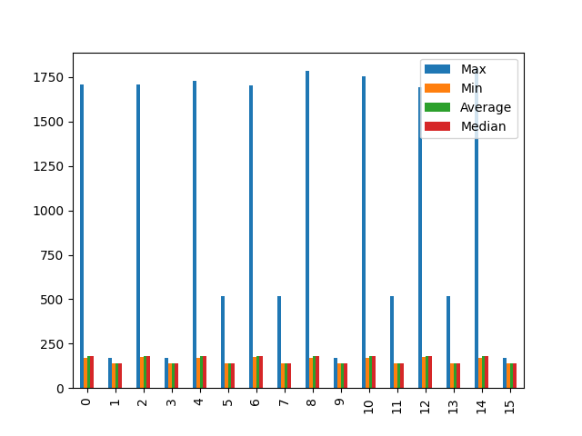
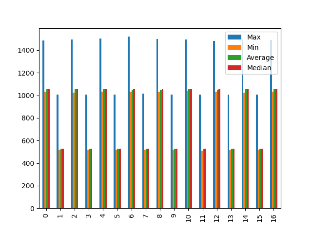
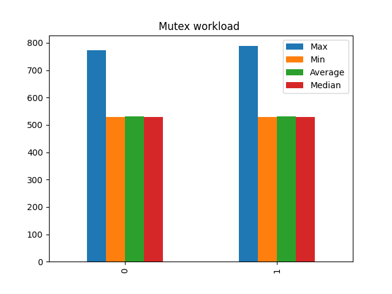
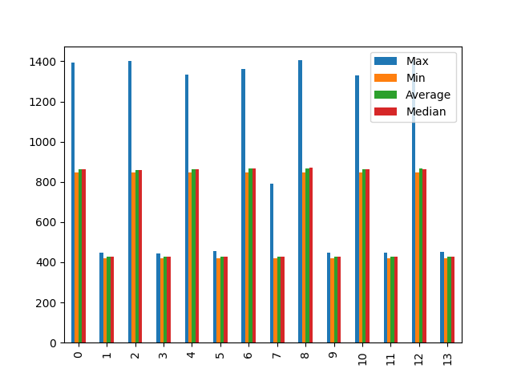
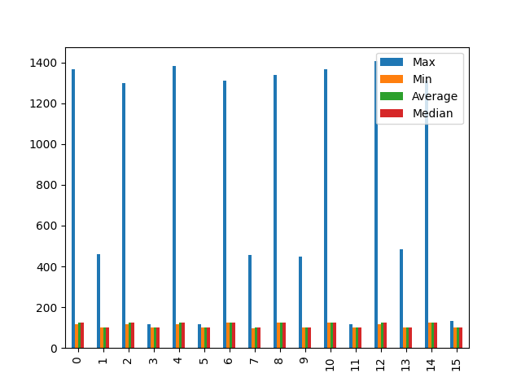
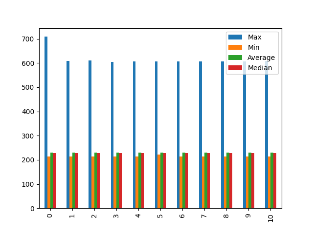
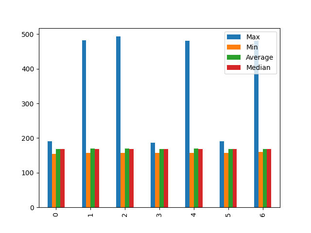

## mq

| Max               |
| ----------------- |
| 1303              |
| 1012              |
| 1334              |
| 890               |
| 1340              |
| 563               |
| 1337              |
| 563               |
| 1337              |
| 563               |
| --------          |
| mq_receive_block  |
| Max               |
| 1303              |
| 1334              |
| 1340              |
| 1337              |
| 1337              |
| --------          |
| mq_signal_unblock |
| Max               |
| 1012              |
| 890               |
| 563               |
| 563               |
| 563               |
 
## mq_workload

| Max         |
| ----------- |
| 2497        |
| 2555        |
| --------    |
| mq_workload |
| Max         |
| 2497        |
| 2555        |
 
## mq_processing

| Max        |
| ---------- |
| 1708       |
| 170        |
| 1708       |
| 170        |
| 1730       |
| 515        |
| 1706       |
| 515        |
| 1784       |
| 170        |
| 1754       |
| 517        |
| 1694       |
| 515        |
| 1800       |
| 170        |
| --------   |
| mq_send    |
| Max        |
| 1708       |
| 1708       |
| 1730       |
| 1706       |
| 1784       |
| 1754       |
| 1694       |
| 1800       |
| --------   |
| mq_receive |
| Max        |
| 170        |
| 170        |
| 515        |
| 515        |
| 170        |
| 517        |
| 515        |
| 170        |
 
## mutex

| Max                   |
| --------------------- |
| 1485                  |
| 1009                  |
| 1494                  |
| 1009                  |
| 1504                  |
| 1009                  |
| 1520                  |
| 1015                  |
| 1498                  |
| 1009                  |
| 1496                  |
| 1009                  |
| 1484                  |
| 1007                  |
| 1496                  |
| 1007                  |
| 1491                  |
| --------              |
| mutex_request_block   |
| Max                   |
| 1485                  |
| 1494                  |
| 1504                  |
| 1520                  |
| 1498                  |
| 1496                  |
| 1484                  |
| 1496                  |
| 1491                  |
| --------              |
| mutex_release_unblock |
| Max                   |
| 1009                  |
| 1009                  |
| 1009                  |
| 1015                  |
| 1009                  |
| 1009                  |
| 1007                  |
| 1007                  |
 
## mutex_pip

| Max       |
| --------- |
| 1505      |
| 1490      |
| 1493      |
| 1485      |
| 1497      |
| 1498      |
| --------  |
| mutex_pip |
| Max       |
| 1505      |
| 1490      |
| 1493      |
| 1485      |
| 1497      |
| 1498      |
 
## mutex_workload

| Max            |
| -------------- |
| 772            |
| 788            |
| --------       |
| mutex_workload |
| Max            |
| 772            |
| 788            |
 
## mutex_processing

| Max               |
| ----------------- |
| 951               |
| 515               |
| 935               |
| 554               |
| 933               |
| 537               |
| 963               |
| 511               |
| --------          |
| mutex_acquisition |
| Max               |
| 951               |
| 935               |
| 933               |
| 963               |
| --------          |
| mutex_release     |
| Max               |
| 515               |
| 554               |
| 537               |
| 511               |
 
## sem

| Max                |
| ------------------ |
| 1393               |
| 448                |
| 1401               |
| 444                |
| 1332               |
| 455                |
| 1361               |
| 791                |
| 1405               |
| 448                |
| 1329               |
| 448                |
| 1405               |
| 452                |
| --------           |
| sem_wait_block     |
| Max                |
| 1393               |
| 1401               |
| 1332               |
| 1361               |
| 1405               |
| 1329               |
| 1405               |
| --------           |
| sem_signal_unblock |
| Max                |
| 448                |
| 444                |
| 455                |
| 791                |
| 448                |
| 448                |
| 452                |
 
## sem_processing

| Max        |
| ---------- |
| 1368       |
| 460        |
| 1300       |
| 117        |
| 1384       |
| 117        |
| 1310       |
| 458        |
| 1338       |
| 447        |
| 1367       |
| 117        |
| 1406       |
| 485        |
| 1310       |
| 132        |
| --------   |
| sem_signal |
| Max        |
| 1368       |
| 1300       |
| 1384       |
| 1310       |
| 1338       |
| 1367       |
| 1406       |
| 1310       |
| --------   |
| sem_wait   |
| Max        |
| 460        |
| 117        |
| 117        |
| 458        |
| 447        |
| 117        |
| 485        |
| 132        |
 
## sem_prio

| Max                     |
| ----------------------- |
| 709                     |
| 608                     |
| 611                     |
| 604                     |
| 606                     |
| 606                     |
| 606                     |
| 606                     |
| 606                     |
| 606                     |
| 608                     |
| --------                |
| sem_singaling_with_prio |
| Max                     |
| 709                     |
| 608                     |
| 611                     |
| 604                     |
| 606                     |
| 606                     |
| 606                     |
| 606                     |
| 606                     |
| 606                     |
| 608                     |
 
## round_robin

| Max                               |
| --------------------------------- |
| 191                               |
| 482                               |
| 493                               |
| 187                               |
| 480                               |
| 191                               |
| 480                               |
| --------                          |
| cooperating_scheduling_ctx_switch |
| Max                               |
| 191                               |
| 482                               |
| 493                               |
| 187                               |
| 480                               |
| 191                               |
| 480                               |
 
