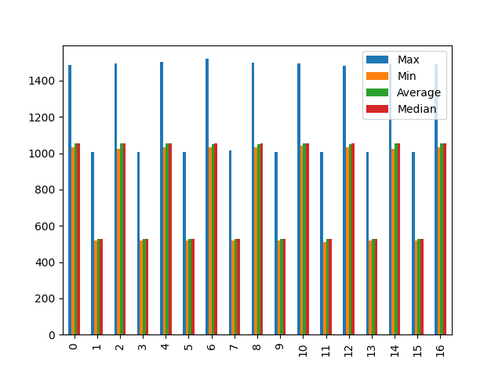

# mutex

| Max                   |
| --------------------- |
| 1485                  |
| 1009                  |
| 1494                  |
| 1009                  |
| 1504                  |
| 1009                  |
| 1520                  |
| 1015                  |
| 1498                  |
| 1009                  |
| 1496                  |
| 1009                  |
| 1484                  |
| 1007                  |
| 1496                  |
| 1007                  |
| 1491                  |
| --------              |
| mutex_request_block   |
| Max                   |
| 1485                  |
| 1494                  |
| 1504                  |
| 1520                  |
| 1498                  |
| 1496                  |
| 1484                  |
| 1496                  |
| 1491                  |
| --------              |
| mutex_release_unblock |
| Max                   |
| 1009                  |
| 1009                  |
| 1009                  |
| 1015                  |
| 1009                  |
| 1009                  |
| 1007                  |
| 1007                  |
