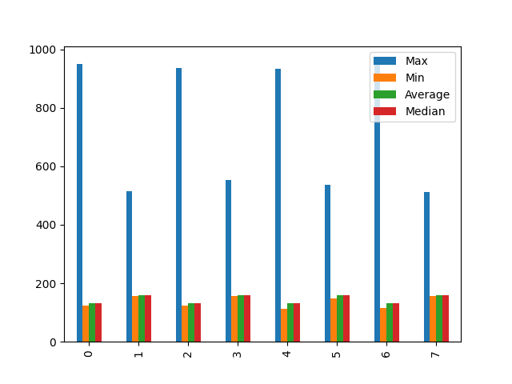

# mutex_processing

| Max | Min | Average            | Median |
| --- | --- | ------------------ | ------ |
| 951 | 123 | 131.99488491048592 | 132.0  |
| 515 | 157 | 160.1388           | 160.0  |
| 935 | 123 | 132.3574           | 132.0  |
| 554 | 157 | 160.154            | 160.0  |
| 933 | 113 | 132.326            | 132.0  |
| 537 | 149 | 160.2158           | 160.0  |
| 963 | 115 | 132.467            | 132.0  |
| 511 | 157 | 160.2146           | 160.0  |
