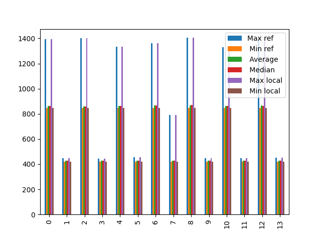

# sem

| Max                |
| ------------------ |
| 1393               |
| 448                |
| 1401               |
| 444                |
| 1332               |
| 455                |
| 1361               |
| 791                |
| 1405               |
| 448                |
| 1329               |
| 448                |
| 1405               |
| 452                |
| --------           |
| sem_wait_block     |
| Max                |
| 1393               |
| 1401               |
| 1332               |
| 1361               |
| 1405               |
| 1329               |
| 1405               |
| --------           |
| sem_signal_unblock |
| Max                |
| 448                |
| 444                |
| 455                |
| 791                |
| 448                |
| 448                |
| 452                |
