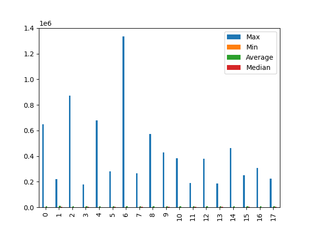
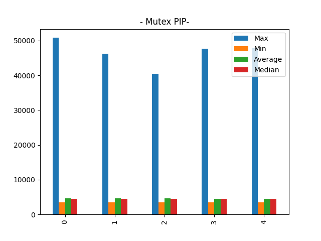
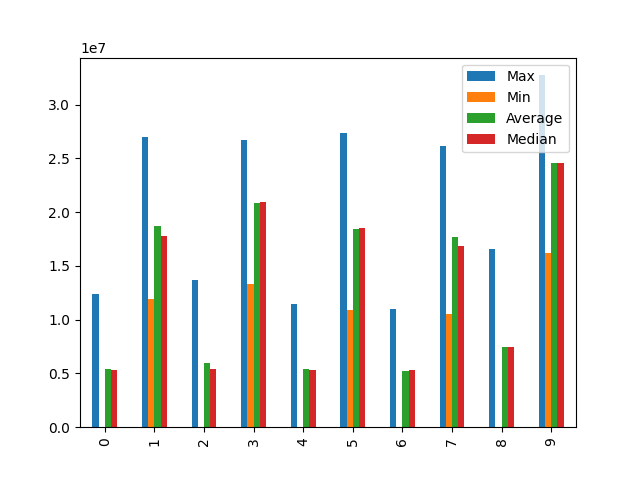

## mq

| Max               |
| ----------------- |
| 650489            |
| 222010            |
| 873304            |
| 179989            |
| 678798            |
| 280847            |
| 1334538           |
| 264488            |
| 571370            |
| 429341            |
| 383217            |
| 191208            |
| 380325            |
| 188085            |
| 463781            |
| 249106            |
| 309340            |
| 223468            |
| --------          |
| mq_receive_block  |
| Max               |
| 650489            |
| 873304            |
| 678798            |
| 1334538           |
| 571370            |
| 383217            |
| 380325            |
| 463781            |
| 309340            |
| --------          |
| mq_signal_unblock |
| Max               |
| 222010            |
| 179989            |
| 280847            |
| 264488            |
| 429341            |
| 191208            |
| 188085            |
| 249106            |
| 223468            |
 
## mq_workload

| Max         |
| ----------- |
| 36752       |
| 35786       |
| 38204       |
| 26694       |
| 28548       |
| --------    |
| mq_workload |
| Max         |
| 36752       |
| 35786       |
| 38204       |
| 26694       |
| 28548       |
 
## mq_processing

| Max        |
| ---------- |
| 17394      |
| 21588      |
| 16382      |
| 11044      |
| 26965      |
| 9359       |
| 18615      |
| 8123       |
| 11758      |
| 21221      |
| --------   |
| mq_send    |
| Max        |
| 17394      |
| 16382      |
| 26965      |
| 18615      |
| 11758      |
| --------   |
| mq_receive |
| Max        |
| 21588      |
| 11044      |
| 9359       |
| 8123       |
| 21221      |
 
## mutex

| Max                   |
| --------------------- |
| 15082382              |
| 26799106              |
| 15209032              |
| 33582060              |
| 15418160              |
| 33323475              |
| 9698968               |
| 21659479              |
| 9383559               |
| 22946278              |
| --------              |
| mutex_release_unblock |
| Max                   |
| 15082382              |
| 15209032              |
| 15418160              |
| 9698968               |
| 9383559               |
| --------              |
| mutex_request_block   |
| Max                   |
| 26799106              |
| 33582060              |
| 33323475              |
| 21659479              |
| 22946278              |
 
## mutex_pip

| Max       |
| --------- |
| 50830     |
| 46279     |
| 40460     |
| 47669     |
| 47872     |
| --------  |
| mutex_pip |
| Max       |
| 50830     |
| 46279     |
| 40460     |
| 47669     |
| 47872     |
 
## mutex_workload

| Max            |
| -------------- |
| 9329           |
| 21573          |
| 25264          |
| 24037          |
| 24031          |
| --------       |
| mutex_workload |
| Max            |
| 9329           |
| 21573          |
| 25264          |
| 24037          |
| 24031          |
 
## mutex_processing

| Max               |
| ----------------- |
| 238               |
| 682               |
| 1098              |
| 897               |
| 17092             |
| 3559              |
| 5221              |
| 3186              |
| 3537              |
| 216               |
| --------          |
| mutex_acquisition |
| Max               |
| 238               |
| 1098              |
| 17092             |
| 5221              |
| 3537              |
| --------          |
| mutex_release     |
| Max               |
| 682               |
| 897               |
| 3559              |
| 3186              |
| 216               |
 
## sem

| Max                |
| ------------------ |
| 12402669           |
| 27012858           |
| 13728098           |
| 26694285           |
| 11448105           |
| 27339225           |
| 11017994           |
| 26147884           |
| 16611958           |
| 32744938           |
| --------           |
| sem_wait_block     |
| Max                |
| 12402669           |
| 13728098           |
| 11448105           |
| 11017994           |
| 16611958           |
| --------           |
| sem_signal_unblock |
| Max                |
| 27012858           |
| 26694285           |
| 27339225           |
| 26147884           |
| 32744938           |
 
## sem_processing

| Max        |
| ---------- |
| 3731       |
| 742        |
| 3428       |
| 247        |
| 529        |
| 189        |
| 3698       |
| 3409       |
| 520        |
| 125        |
| --------   |
| sem_signal |
| Max        |
| 3731       |
| 3428       |
| 529        |
| 3698       |
| 520        |
| --------   |
| sem_wait   |
| Max        |
| 742        |
| 247        |
| 189        |
| 3409       |
| 125        |
 
## sem_prio

| Max                     |
| ----------------------- |
| 11732                   |
| 13757                   |
| 23190                   |
| 7422                    |
| 7704                    |
| --------                |
| sem_singaling_with_prio |
| Max                     |
| 11732                   |
| 13757                   |
| 23190                   |
| 7422                    |
| 7704                    |
 
## round_robin

| Max                               |
| --------------------------------- |
| 20539058                          |
| 17867889                          |
| 18683964                          |
| 23169610                          |
| 16961963                          |
| --------                          |
| cooperating_scheduling_ctx_switch |
| Max                               |
| 20539058                          |
| 17867889                          |
| 18683964                          |
| 23169610                          |
| 16961963                          |
 
