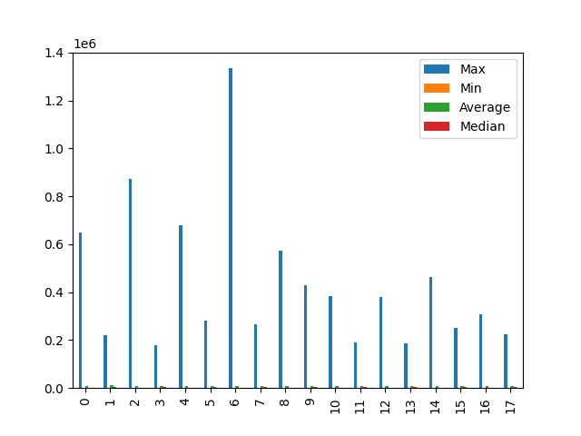

# mq

| Max               |
| ----------------- |
| 650489            |
| 222010            |
| 873304            |
| 179989            |
| 678798            |
| 280847            |
| 1334538           |
| 264488            |
| 571370            |
| 429341            |
| 383217            |
| 191208            |
| 380325            |
| 188085            |
| 463781            |
| 249106            |
| 309340            |
| 223468            |
| --------          |
| mq_receive_block  |
| Max               |
| 650489            |
| 873304            |
| 678798            |
| 1334538           |
| 571370            |
| 383217            |
| 380325            |
| 463781            |
| 309340            |
| --------          |
| mq_signal_unblock |
| Max               |
| 222010            |
| 179989            |
| 280847            |
| 264488            |
| 429341            |
| 191208            |
| 188085            |
| 249106            |
| 223468            |
